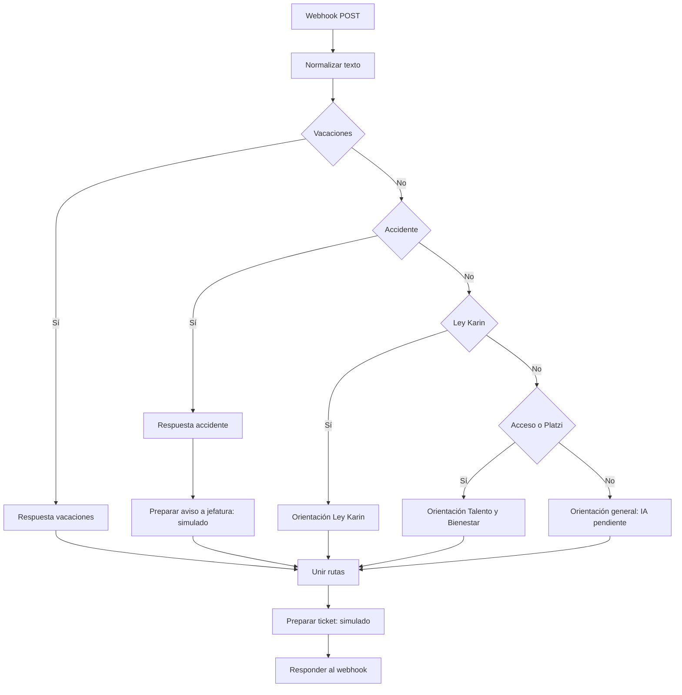
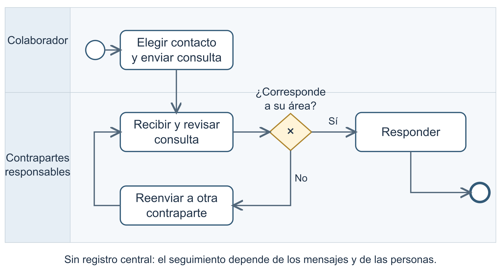
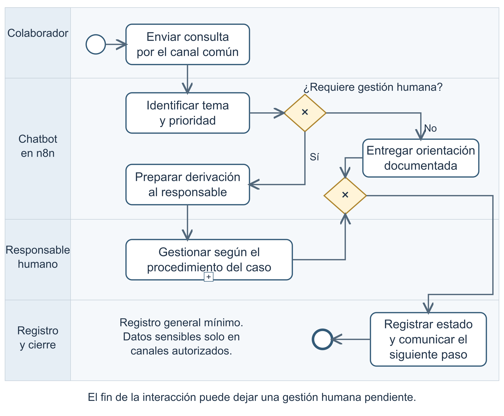

# Arquitectura del piloto

## Recorrido del JSON entregado

La rama de accidente incluye además el IF de escalamiento del piloto, configurado para continuar siempre por la salida verdadera.

## Componentes

| Componente | Implementación actual |
|---|---|
| Entrada | Webhook POST, ruta `adipa-chatbot` |
| Normalización | Código JavaScript que convierte a minúsculas y elimina tildes |
| Clasificación | Nodos IF con expresiones regulares, evaluados en orden |
| Respuestas | Nodos Set con textos definidos |
| Escalamiento | Set que asigna `destinatarioPrevisto`; no envía Email/Slack |
| Unión | Merge configurado con `chooseBranch`; recibe las rutas alternativas |
| Registro | Set que calcula `ticketId`; no escribe en una base |
| Salida | Respond to Webhook devuelve categoría, respuesta e identificador |
| IA | No existe un modelo o recuperador documental conectado |

## Propuesta de procesos

Los procesos describen responsabilidades de negocio. La arquitectura del piloto implementa una parte de esa propuesta. Una respuesta automática no equivale al cierre de una solicitud formal, a una denuncia presentada o a un accidente atendido.

## Tratamiento de datos

El código conserva el mensaje original, la versión normalizada, el identificador de colaborador y una marca temporal durante la ejecución. Aunque no hay base de datos conectada, n8n puede conservar datos en su historial de ejecuciones según su configuración. Usa datos ficticios para esta evaluación.

Antes del uso real deben definirse acceso, retención y minimización de datos. El registro general propuesto para temas sensibles debe limitarse a categoría, momento y estado; los antecedentes se gestionan por los canales autorizados del protocolo.
